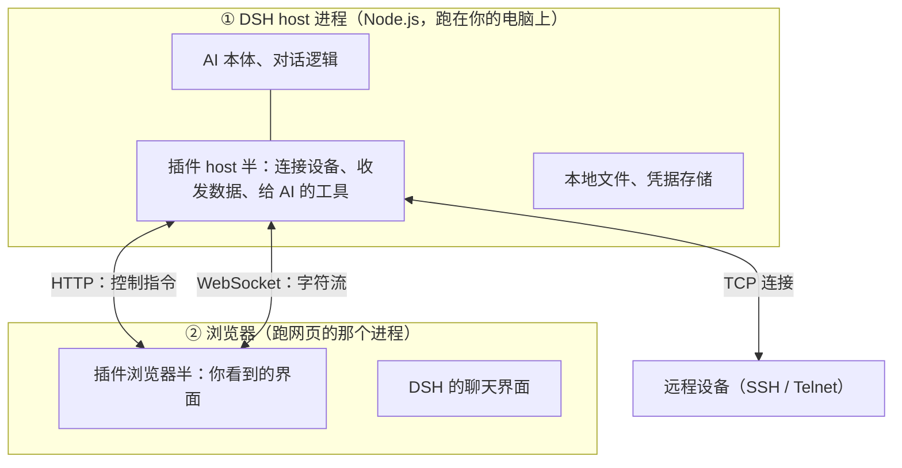
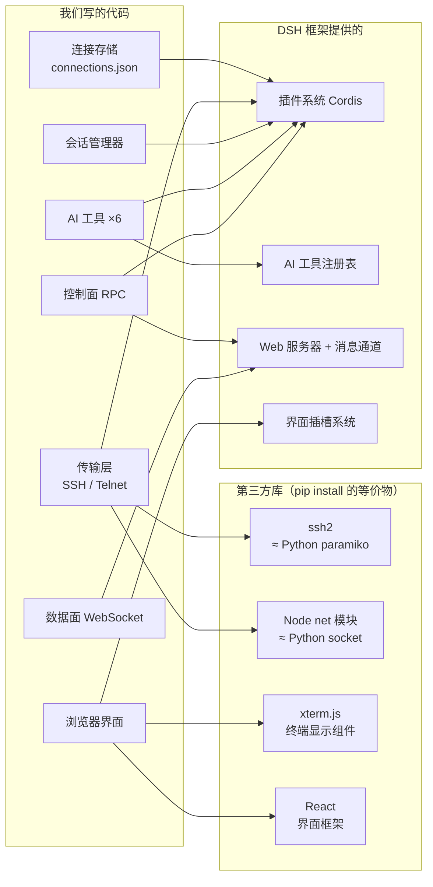
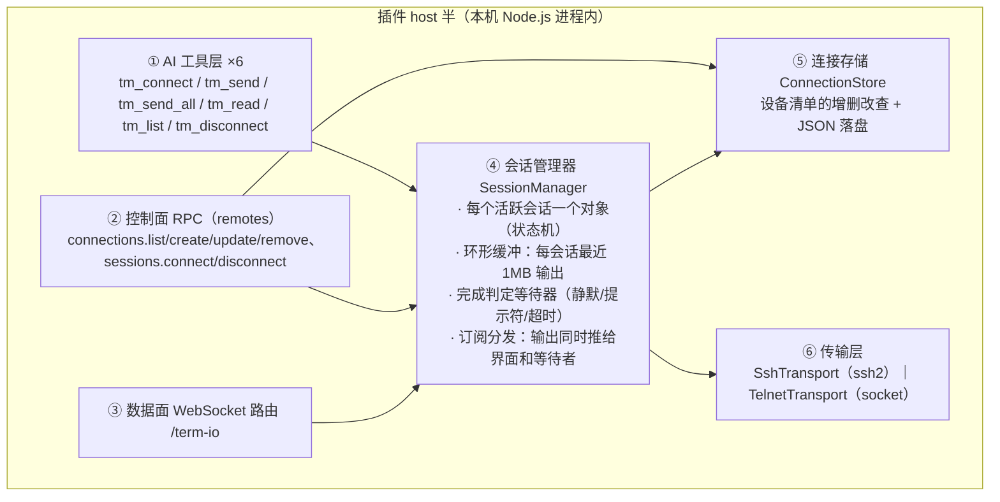
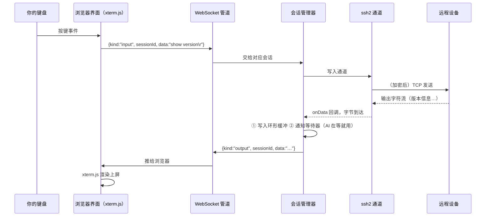

# 软件架构与技术栈详解（写给懂 C++ / Python 的你）

- 日期：2026-08-26
- 前置阅读：`docs/solution.zh.md`（方案讲解稿）
- 本文用 C++ / Python 的类比，把「这套东西到底是什么、由什么构成」讲清楚

---

## 一、先回答：这门语言是什么？为什么是它？

**TypeScript（TS）= 带静态类型的 JavaScript**。

| 你熟悉的 | 对应物 | 说明 |
|---|---|---|
| Python | JavaScript | 解释型、动态类型、带垃圾回收；浏览器里唯一能跑的语言 |
| Python 的 type hints | TypeScript 的类型 | 但更进一步：**构建时强制检查**，类型错误编译不过（更像 C++ 编译期检查，但类型最终会被"擦掉"，产物是纯 JS） |
| C++ 编译器 | `tsdown`（本项目用的构建工具） | 把 TS 源码"编译"成浏览器/Node 能直接跑的 JS，顺带打包 |
| pip | pnpm（包管理器） | 从 npm 仓库拉第三方库；本项目里 `ssh2`、`xterm.js` 都是这样装的 |
| Python 解释器 | **Node.js** | JavaScript 的"解释器"，让 JS 能脱离浏览器在电脑上跑（读写文件、开网络连接） |

**为什么非用 TS 不可**：DSH 框架本体就是 TypeScript 写的，插件必须用宿主的语言写——就像给一个 Python 程序写插件你得用 Python，给 C++ 宿主写插件你得按它的 ABI 来。

## 二、软件跑在哪里：两个"进程"，一个插件

这是理解架构的第一把钥匙。DSH 启动后，实际上有**两个运行环境**：



类比：
- **host 进程** ≈ 一个后台服务程序（像你写的 C++ daemon 或 Python 服务）——真正干活：连设备、存数据、跑 AI。
- **浏览器半** ≈ 一个"远程显示器 + 遥控器"——只负责画界面、把你的操作发给 host。
- 我们的插件**同时有两半**，分别装进这两个环境。这就是文档里反复说的「双半包」。

**为什么不把所有东西都放浏览器里？** 因为浏览器出于安全限制，**不允许网页直接发起任意的 TCP/SSH 连接**——必须有一个本机程序代劳，那个程序就是 host 半。

## 三、技术栈全景：每一块是干什么的



逐个解释：

| 组件 | 类比 | 职责 |
|---|---|---|
| **ssh2** | Python 的 paramiko | 实现 SSH 协议：握手、密码/密钥认证、加密通道。我们只调用它的 API，不碰协议细节 |
| **Node `net` 模块** | Python 的 `socket` | Telnet = 裸 TCP，语言自带的 socket 库就够，无需第三方 |
| **xterm.js** | 一个"终端显示器"控件 | 浏览器里画出终端的样子：等宽字体、ANSI 颜色码、光标、滚动回看。设备的原始输出字节直接喂给它 |
| **React** | 类似 Qt 的界面框架 | 用"组件"拼界面（一个连接卡片是一个组件，一个终端窗格是一个组件），数据变了界面自动刷新 |
| **WebSocket** | 一条浏览器里的"TCP 长连接" | 建立一次，双向随时发消息。字符流就走它（HTTP 是一问一答，不适合连续流） |
| **Cordis** | 插件框架 ≈ Qt 插件系统 | DSH 的插件机制：你的插件声明"我需要什么服务"，框架准备好后调用你的入口函数 |
| **JSON 文件** | 一个简单数据库 | 连接配置就存在一个本地 JSON 文件里（文本格式，类似 Python 的 dict 直接落盘） |

## 四、插件内部架构：五个模块，各管一摊

host 半内部是这样分层的（从上到下：离用户近的在上）：



用 C++ 的话说：
- **SessionManager** 像一个"连接池管理器"：内部一个 `std::map<SessionId, Session>`，每个 `Session` 是带状态机的对象（`未连接→连接中→已连接`），持有一个环形缓冲区（`circular_buffer<char, 1MB>`）和一组输出监听器。
- **传输层**是接口 + 两个实现：`class Transport { virtual write(); virtual close(); onData 回调; }`，`SshTransport` 和 `TelnetTransport` 各自实现。换协议 = 换个实现，上层不用改——这就是"面向接口编程"，和 C++ 虚基类一个思路。
- **完成判定**是一个纯逻辑模块（给一段输出流，判断"命令跑完了没"），最好测试的部分。

## 五、一次按键的完整旅程（把一切串起来）

你在界面的终端里敲了 `show version` 然后回车：



**AI 发命令的旅程**：AI 调用 `tm_send` → 工具层调会话管理器的 `sendAndWait` → 同样的写入路径 → 但输出不急着推给谁，而是喂给**完成判定等待器** → 判定"跑完了"→ 整段输出作为工具结果还给 AI。

**注意两条路共享同一个会话对象**——所以 AI 跑命令时你能实时看见，你打字 AI 也能感知。这就是"人机共用一批终端"在代码层的落点。

## 六、构建与打包：代码怎么变成能跑的东西

```
源码（.ts/.tsx，你写的）
    │  tsdown 构建（≈ 编译 + 打包）
    ├──► lib/index.js    host 半：Node.js 模块，由 DSH host 进程加载
    └──► lib/client.js   浏览器半：特殊格式，浏览器启动时由 DSH 注入页面
```

- 开发循环：改代码 → `pnpm build`（几秒钟）→ 重启/刷新 DSH → 看效果。
- 交付：整个仓库就是一个 npm 包，`dsh plugin add` 一条命令装进任何 DSH。
- **测试**：`vitest` 框架（≈ Python 的 pytest）——写 `xxx.spec.ts`，断言函数行为；跑 `pnpm test` 全绿才算过。M2 开始我们的每个模块都配测试。

## 七、安全边界在哪里

| 边界 | 机制 | 类比 |
|---|---|---|
| 浏览器 ↔ host | 只接受本机/受信来源的请求（DSH 的信任栅栏） | 服务只监听 127.0.0.1 |
| 凭据存储 | 本地文件、仅本人可读；日志/返回值里永不出现 | 一个 600 权限的配置文件 |
| SSH 主机密钥 | MVP 接受任意 + 显示指纹；后续做"首次信任" | 第一次见面的指纹核对 |
| AI 的操作 | 全部经过工具层，可被 DSH 的权限策略拦截审计 | 所有系统调用过一道 gate |

---

**一句话总结**：Node.js 里跑一个"设备连接服务"（host 半），浏览器里装一块"显示器 + 遥控器"（浏览器半），中间两条路（指令走 HTTP、字符走 WebSocket），AI 通过六个工具接入同一个服务——所有状态只有一份，人和 AI 看到的是同一个世界。
