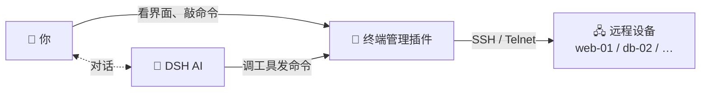
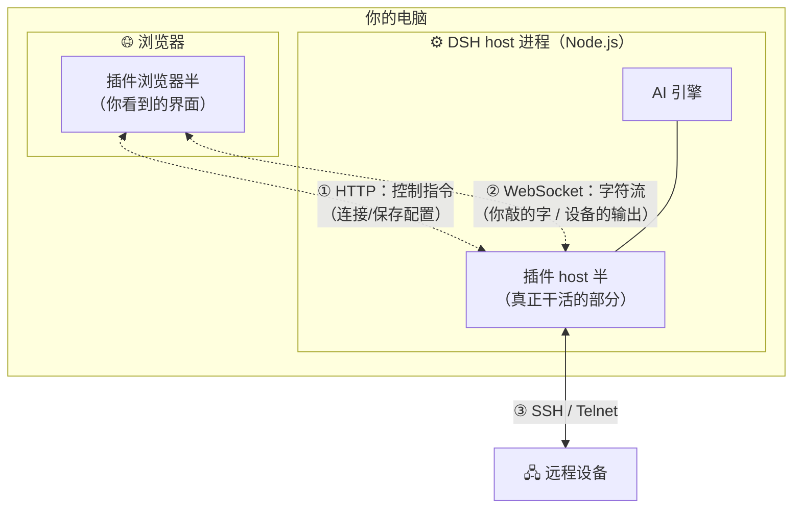
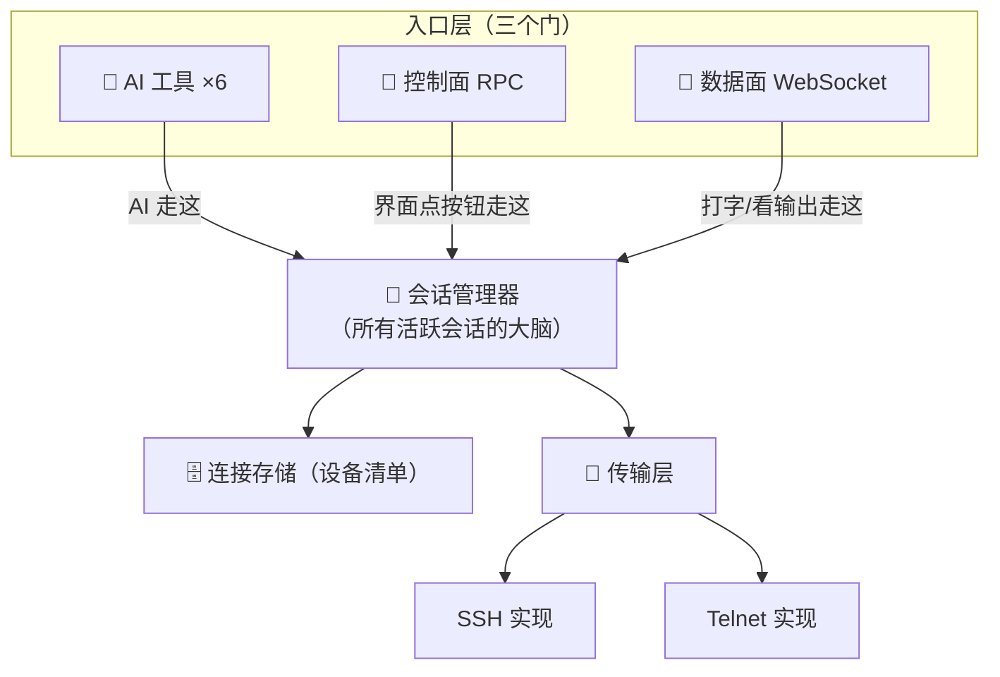
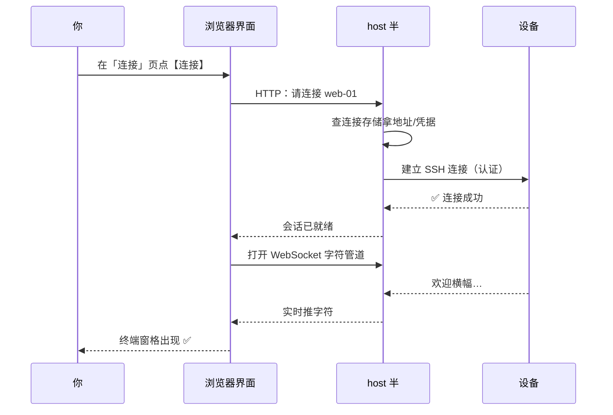
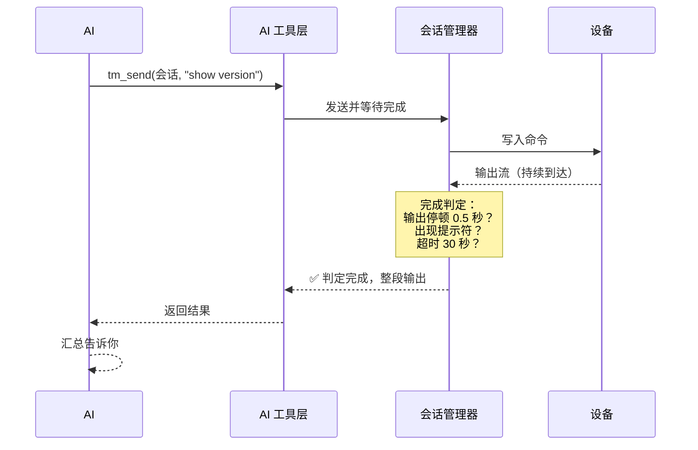
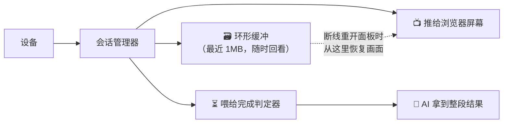
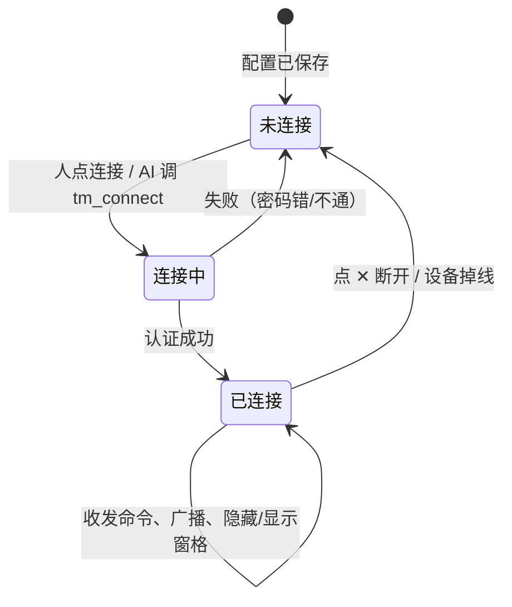
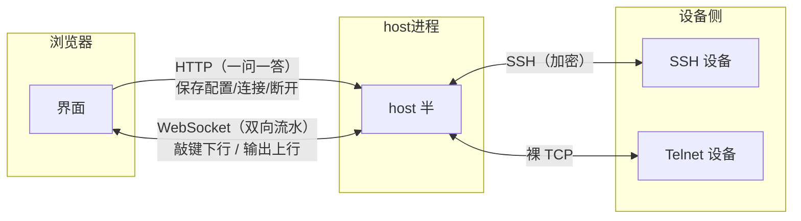
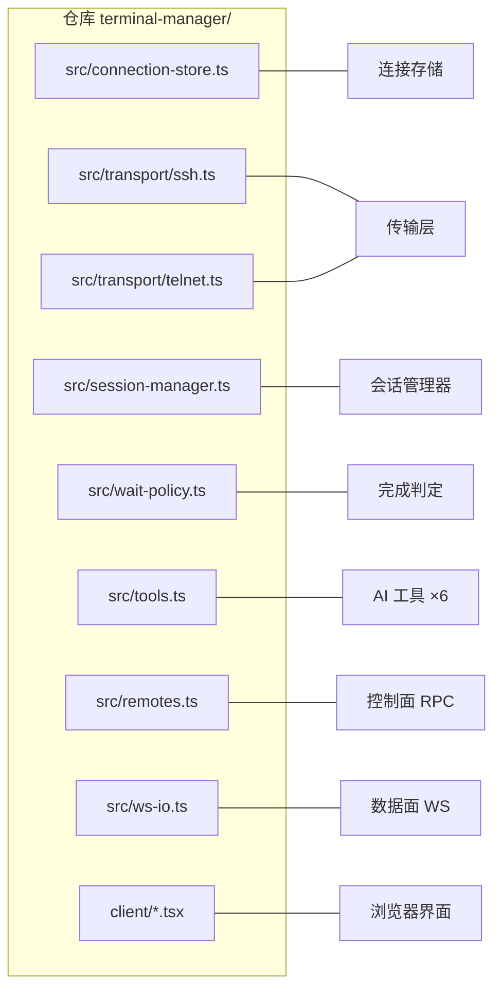
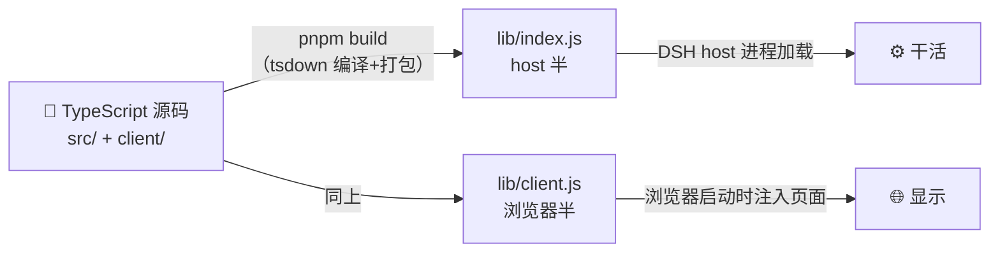

# 架构图解（看图版）

- 每张图配一句话说明；想读文字版看 `docs/architecture.zh.md`
- 日期：2026-08-26

---

## 图 1：整个系统里都有谁

> 三个角色：你和 AI 都在 DSH 里，设备在外面，插件是中间那座桥。

## 图 2：代码跑在哪两个地方

> 同一个插件分两半：一半在你电脑的 DSH 进程里干活，一半在浏览器里画界面。

## 图 3：插件内部模块地图

> 六块积木，从上往下调用：AI 工具和界面都通过中间的「会话管理器」操作设备。

## 图 4：一次「人点连接」的流程

> 从你点按钮到终端出现，经过的站点。

## 图 5：一次「AI 发命令」的流程

> AI 走工具门，多了一步「等命令跑完」的判定。

## 图 6：输出只有一份，同时送往两处

> 这是「人和 AI 共用终端」的核心：设备输出进缓冲后兵分两路。

## 图 7：一个会话的一生

> 状态机：只能按箭头走，断线不会凭空消失。

## 图 8：四条通信管道，各干各的

> 谁走哪条路，一眼分清。

## 图 9：代码目录 ↔ 模块对照

> 以后看代码时按图索骥。

## 图 10：构建打包一条线

> 你写的 TS → 两个产物 → 分别装进两个环境。

---

**还有哪里晕，指给我看——可以继续补图。**
