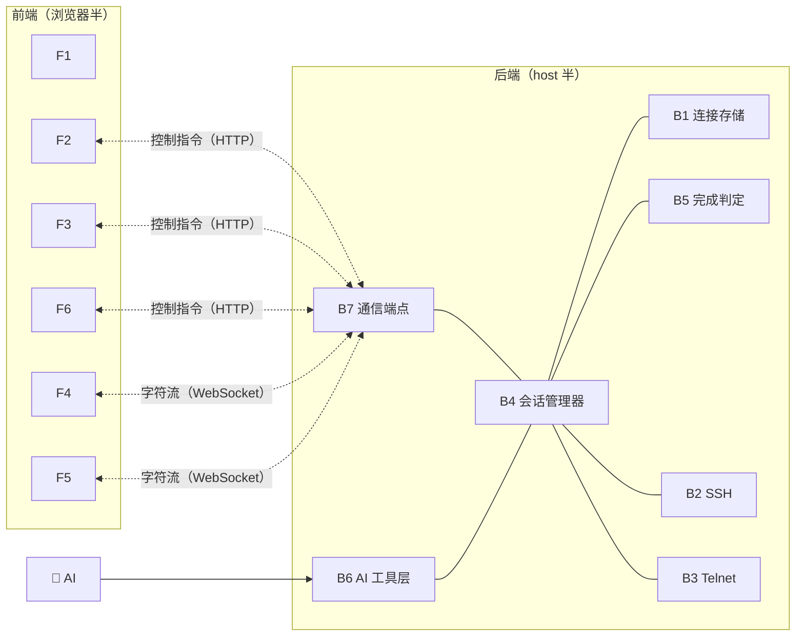

# 需求分析：前端/后端模块清单 + 场景化需求拆解

- 日期：2026-08-26
- 上游：`intent.md`（意图）→ `spec.md`（功能需求 F1–F8）→ **本文：场景拆解**
- 下游：里程碑计划（plan.md）、Test 阶段的 eval 用例（每个场景至少一条）

---

## 一、前端是什么？后端是什么？

用网站开发的黑话对齐一下：

- **后端 = 「host 半」**：跑在你电脑 DSH 进程里的服务代码。所有"真事"在这里发生：连设备、存配置、收发字节、给 AI 的工具。
- **前端 = 「浏览器半」**：跑在网页里的界面代码。只负责"显示"和"把你的操作转告后端"。

### 后端模块清单（7 个）

| # | 模块 | 一句话职责 | 代码文件（M2 起创建） | 支撑需求 |
|---|---|---|---|---|
| B1 | **连接存储** ConnectionStore | 设备清单的增删改查 + 存到本地文件 | `src/connection-store.ts` | S1/S12 |
| B2 | **SSH 传输** SshTransport | 用 ssh2 库建立加密连接、收发 | `src/transport/ssh.ts` | S2 |
| B3 | **Telnet 传输** TelnetTransport | 裸 TCP 连接、收发 | `src/transport/telnet.ts` | S2 |
| B4 | **会话管理器** SessionManager | 管理所有活跃会话：状态、内存缓冲、输出分发 | `src/session-manager.ts` | 几乎所有 |
| B5 | **完成判定** WaitPolicy | 判断"一条命令跑完没有"（静默/提示符/超时） | `src/wait-policy.ts` | S7/S8 |
| B6 | **AI 工具层** tm_* ×6 | AI 调用插件的六个入口 | `src/tools.ts` | S7/S8/S9 |
| B7 | **通信端点**（控制面 RPC + 数据面 WS） | 前端连进来的两条路 | `src/remotes.ts`、`src/ws-io.ts` | 所有前端操作 |

### 前端模块清单（6 个）

| # | 模块 | 一句话职责 | 代码文件（M4 创建） | 支撑需求 |
|---|---|---|---|---|
| F1 | **入口与挂载** | 侧边栏按钮、面板开关、页签外壳 | `client/index.tsx`、`client/TerminalPanel.tsx` | 全部 |
| F2 | **连接页** ConnectionsTab | 连接卡片列表 + 新建/编辑表单（必填/选填） | `client/ConnectionsTab.tsx` | S1/S12 |
| F3 | **终端页** TerminalsTab | 状态条 + 终端网格 + 广播栏 | `client/TerminalsTab.tsx` | S3–S6/S13 |
| F4 | **终端组件** TermView | 单个终端窗格（xterm.js 显示 + 键盘输入） | `client/TermView.tsx` | S3/S4/S14 |
| F5 | **WS 客户端** | 与后端字符管道的收发、断线重连 | `client/ws.ts` | S3/S4 |
| F6 | **界面状态同步** | 会话列表/状态徽标与后端保持一致 | `client/TerminalPanel.tsx` 内 | 全部 |

---

## 二、场景化需求拆解（14 个用户场景）

每个场景 = 一次"谁、在什么时候、做什么、期望什么"。标注：**涉及模块**、**验收要点**、**归属里程碑**。

### 组一：配置管理

| 场景 | 描述 | 涉及模块 | 验收要点 | 里程碑 |
|---|---|---|---|---|
| **S1 新建连接** | 用户填名称/协议/地址/凭据，保存 | F2、B1、B7 | 必填校验（红框提示）；SSH 密码/密钥二选一；落盘成功 | M4 |
| **S12 编辑/删除连接** | 修改已有连接、删除不用的 | F2、B1、B7 | 编辑回填表单；删除前先断开该会话 | M4 |

### 组二：连接与观察

| 场景 | 描述 | 涉及模块 | 验收要点 | 里程碑 |
|---|---|---|---|---|
| **S2 一键连接** | 点「连接」→ 终端出现并显示设备输出 | F2/F3、B2 或 B3、B4、B7 | SSH 密码/密钥都能连；连接中→已连接状态变化可见 | M2 后端通路、M4 界面 |
| **S3 多设备同屏** | 同时开 3+ 个终端，各自实时输出 | F3、F4、F5、B4、B7 | 互不串扰；滚动流畅；隐藏/恢复不影响连接 | M4 |
| **S13 隐藏/显示窗格** | 点状态条芯片隐藏某个终端（不断开） | F3、B4 | 隐藏后仍在线、仍能收广播；点回即恢复 | M4 |
| **S14 多终端聚焦** | 终端超过 3 个，⛶ 最大化单格 | F3、F4 | 最大化/还原正常；断开时自动还原 | M4 |

### 组三：手动操作

| 场景 | 描述 | 涉及模块 | 验收要点 | 里程碑 |
|---|---|---|---|---|
| **S4 手动敲命令** | 在终端里打字、回车、看到设备响应 | F4、F5、B4、B7 | 按键即达；输出即显；支持中文 | M2/M4 |
| **S5 广播到全部** | 广播栏发一条命令到所有打开的会话 | F3、B4、B7 | 每个终端都回显；慢设备不拖慢其他 | M2 后端、M4 界面 |
| **S6 广播到部分** | 点选其中几台再广播 | F3、B4 | 未选中的会话无此命令；按钮显示目标数 | M4 |

### 组四：AI 自动化（本插件的核心价值）

| 场景 | 描述 | 涉及模块 | 验收要点 | 里程碑 |
|---|---|---|---|---|
| **S7 AI 单机测试** | AI 调 `tm_connect` + `tm_send`，拿回整段输出 | B6、B4、B5、B2/B3 | 输出完整；`waitReason` 正确；超时不卡死 | M2/M3 |
| **S8 AI 批量测试** | AI 调 `tm_send_all` 广播测试并汇总各设备结果 | B6、B4 | 每台单独出结果；某台忙碌报 `busy` 不拖累其他 | M3 |
| **S9 AI 读现场** | AI 调 `tm_read` 看某会话当前屏幕内容 | B6、B4 | 能读到最近缓冲；分页正确 | M3 |
| **S10 人机共视/接管** | AI 在跑命令时用户实时看见；AI 跑完用户接着敲 | F4、B4（同一会话） | 无两套状态；交接无缝 | M4 联调 |

### 组五：异常处理

| 场景 | 描述 | 涉及模块 | 验收要点 | 里程碑 |
|---|---|---|---|---|
| **S11 连接异常** | 密码错 / 地址不通 / 设备中途掉线 | B2/B3、B4、F3 | 明确报错（不泄露密码！）；状态徽标变错误；掉线后可重连 | M2 |

---

## 三、场景 → 里程碑 → 验收的追踪

```mermaid
flowchart LR
    subgraph M2["M2 连接核心（后端）"]
        S2a["S2 连接通路"]
        S4a["S4 收发"]
        S5a["S5 广播"]
        S7a["S7 AI 单机"]
        S11["S11 异常"]
    end
    subgraph M3["M3 AI 工具面"]
        S7b["S7 完整"]
        S8["S8 批量"]
        S9["S9 读现场"]
    end
    subgraph M4["M4 真界面"]
        S1["S1/S12 配置"]
        S3["S3 多设备"]
        S13["S13 隐藏"]
        S14["S14 聚焦"]
        S6["S6 部分广播"]
        S10["S10 人机共视"]
    end
    subgraph M5["M5 验收"]
        演示["14 个场景全部过一遍"]
        eval["Test 阶段：每个场景 ≥1 条 eval"]
    end
    M2 --> M3 --> M4 --> M5
```

## 四、说明

1. **场景清单不是凭空新增需求**——全部来自 intent.md 的 MVP 范围与选型结论，这里只是拆细、编号、可追踪。
2. **每个场景将来至少变成一条自动化考题**（Test 阶段的 eval 套件），防止后续改动把某个场景改坏。
3. 如果你想到新的使用场景（比如"定时巡检"、"命令收藏"），现在提出来我登记进清单排期；MVP 之后的场景记为后续项，不打断当前节奏。
