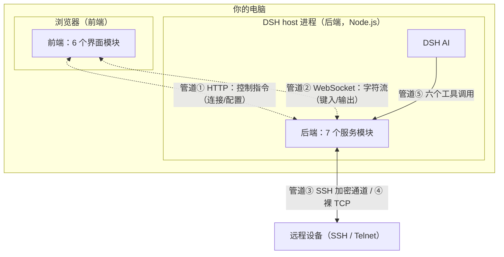
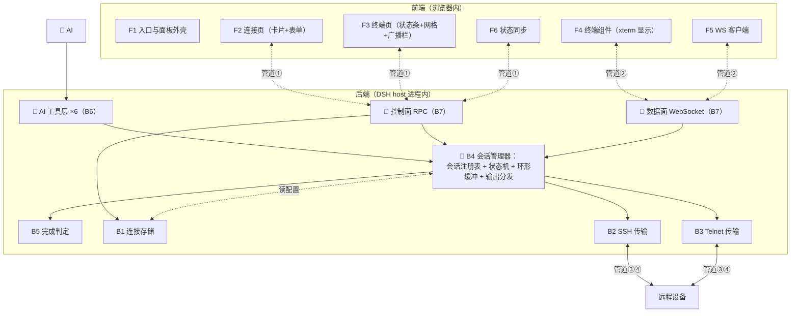

# DSH 终端管理插件 — 方案设计

- 版本：v3（吸收外部 AI 评审 10 条意见后修订）
- 日期：2026-08-26
- 状态：已随 M1 定稿（定稿依据：产品负责人多轮评审并逐项确认，见 `prototypes/SELECTION.zh.md` 及提交记录 `31a5baf`→`f94d2ce`）；实施基准

---

# 第一部分：目标

## 1.1 要解决的问题（一句话）

管多台设备终端太累，而且 **AI 碰不到这些终端**——本插件让「人」和「AI」共用同一批远程终端（SSH / Telnet），互相看得见、接得上手。

## 1.2 需求拆解（场景化）

大需求拆成 14 个使用场景，分五组。每个场景后续都对应代码模块（第三部分）和自动化考题（Test 阶段）。

**组一：配置管理**

| 编号 | 场景 | 期望结果 |
|---|---|---|
| S1 | 新建连接 | 表单区分必填/选填（SSH 密码/密钥二选一必填，Telnet 均可选），保存即入库 |
| S12 | 编辑 / 删除连接 | 编辑回填表单；删除自动先断开 |

**组二：连接与观察**

| 编号 | 场景 | 期望结果 |
|---|---|---|
| S2 | 一键连接 | 点连接 → 状态「连接中→已连接」→ 终端出现并实时输出 |
| S3 | 多设备同屏 | 3+ 终端各自实时输出，互不串扰 |
| S13 | 隐藏 / 显示窗格 | 点状态条芯片隐藏某终端（不断开）；**隐藏后芯片变暗 + 虚线边框、名称保留**，一眼能看出"还在连着只是没显示"，点击恢复 |
| S14 | 多终端聚焦 | 超过 3 个终端时，单格最大化 / 还原 |

**组三：手动操作**

| 编号 | 场景 | 期望结果 |
|---|---|---|
| S4 | 手动敲命令 | 按键即达、输出即显 |
| S5 | 广播到全部会话 | 所有打开的终端同时回显，慢设备不拖慢别人 |
| S6 | 广播到部分会话 | 芯片点选目标，按钮显示目标数 |

**组四：AI 自动化（核心价值）**

| 编号 | 场景 | 期望结果 |
|---|---|---|
| S7 | AI 单机测试 | AI 连接 + 发命令，**等执行完**拿回整段输出 |
| S8 | AI 批量测试 | 一条命令广播多设备，逐台返回结果并汇总 |
| S9 | AI 读现场 | 读取某会话当前屏幕缓冲 |
| S10 | 人机共视 / 接管 | AI 跑命令时人实时看见，跑完人接着敲，无两套状态 |

**组五：异常**

| 编号 | 场景 | 期望结果 |
|---|---|---|
| S11 | 密码错 / 不通 / 掉线 | 明确报错（不泄露密码）、状态可见、可重连 |

## 1.3 MVP 边界（明确不做）

串口、文件传输（SFTP）、设备日志文件拉取、多用户协作、云端部署、审计录屏、**SSH 跳板机/堡垒机（ProxyJump）**——跳板机若你的环境必需，联调前告诉我，实现上预留了接缝（见 3.7 扩展表）。

---

# 第二部分：技术架构与选型

## 2.1 整体架构（一张图理清）



五条管道，各管一件事：

| 管道 | 形态 | 跑什么 | 类比 |
|---|---|---|---|
| ① 控制指令 | HTTP（一问一答） | 保存配置、连接、断开 | 寄挂号信，要回执 |
| ② 字符流 | WebSocket（双向长连接） | 你敲的键、设备的输出 | 专用电话线 |
| ③ SSH | 加密 TCP | 到 SSH 设备 | 保密专线 |
| ④ Telnet | 裸 TCP | 到 Telnet 设备 | 普通电话线 |
| ⑤ 工具调用 | 进程内函数调用 | AI → 后端 | 同事直接喊一嗓子 |

**为什么分前端/后端**：浏览器被安全限制禁止直接发起任意 TCP/SSH 连接，必须有本机服务代劳——后端干所有真事，前端只管显示和转发操作。

## 2.2 核心技术选型

| 选型 | 选了什么 | 为什么 | 放弃的备选 |
|---|---|---|---|
| 语言 | TypeScript（DSH 宿主语言） | 插件必须说宿主的语言 | 无可选 |
| SSH 实现 | `ssh2` 库（≈ Python paramiko） | 成熟、纯 JS、支持密码+密钥 | 自己实现协议（不现实） |
| SSH 会话模式 | `conn.shell()` 交互式通道（带 PTY） | 人和 AI 共用一种交互模式：实时看输出、可接着敲、会话可持续 | `exec()` 一次性命令（无法共享会话、看不到中间输出，放弃） |
| Telnet 实现 | **待定**：Node 自带 `net`（裸 TCP）或 `telnet-client` 库 | 取决于实际设备：裸 TCP 简单但跳过协议协商，个别设备会回显异常；库处理协商但年久失修 | 待确认设备类型后定（见文末待确认项） |
| 终端显示 | `xterm.js` | 浏览器终端渲染的事实标准，支持 ANSI 颜色/光标/滚动 | 自己画（几百个坑） |
| 界面框架 | React 18 + CSS Modules | 与 DSH 界面技术栈一致 | 其他框架（格格不入） |
| 字符通道 | 插件自注册 WebSocket 路由 | 高频小包双向流，HTTP 不适合 | 全走 HTTP（延迟差） |
| 配置持久化 | 本地 JSON 文件，权限尽力限为仅本人可读（Linux 0600 / Windows 等效 ACL） | 规模小、无并发写、简单可靠；**明文是 MVP 已接受的风险**，文档明示，后续迭代接 DSH 自带的凭据服务 | SQLite（过重） |
| 命令完成判定 | 静默期 + 提示符正则 + 超时三重 | 适配千奇百怪的设备回显 | 只靠其中一种（都会误判） |
| 会话归属模型 | **插件自持公共会话池** | 人和 AI 双向平等、互看互操作 | DSH 自带终端（AI 私有、只本机，做不到共享） |

---

# 第三部分：核心功能模块拆解与代码组织

## 3.1 核心逻辑一句话

**所有会话归后端「会话管理器」统一持有；人从前端进来、AI 从工具进来，走的是同一个池子**——这就是"人机共用"的代码落点。每个活跃会话内部：一条设备连接 + 一块输出缓冲 + 一组等待者。



## 3.2 模块清单与安放位置

### 后端 7 模块（`src/`，M2–M3 实现）

| 模块 | 文件 | 职责 | 覆盖场景 |
|---|---|---|---|
| B1 连接存储 | `src/connection-store.ts` | 连接配置增删改查 + JSON 落盘；文件权限尽力限为仅本人（含 Windows 处理） | S1/S12 |
| B2 SSH 传输 | `src/transport/ssh.ts` | ssh2 连接/认证/收发/关闭；统一 `shell()` 交互通道（带 PTY，尺寸随终端调整） | S2/S11 |
| B3 Telnet 传输 | `src/transport/telnet.ts` | 裸 TCP 连接/收发/关闭（协议协商接缝已留） | S2/S11 |
| B4 会话管理器 | `src/session-manager.ts` | 会话状态机、缓冲、输出分发、广播、独占发送 | 几乎全部 |
| B5 完成判定 | `src/wait-policy.ts` | 静默/提示符/超时三重判定 | S7/S8 |
| B6 AI 工具层 | `src/tools.ts` | tm_connect/list/send/send_all/read/disconnect | S7–S9 |
| B7 通信端点 | `src/remotes.ts`（控制面 RPC）+ `src/ws-io.ts`（数据面 WS），**两个独立文件、两套互不牵连的错误处理**——WS 挂了不影响控制指令，反之亦然 | 前端所有操作 |

### 前端 6 模块（`client/`，M4 实现，视觉基准 = `prototypes/full-view-bc.html`）

| 模块 | 文件 | 职责 | 覆盖场景 |
|---|---|---|---|
| F1 入口与外壳 | `client/index.tsx`、`TerminalPanel.tsx` | 侧边栏入口、面板开关、双页签 | 全部 |
| F2 连接页 | `client/ConnectionsTab.tsx` | 连接卡片 + 新建/编辑表单（必填/选填校验） | S1/S12 |
| F3 终端页 | `client/TerminalsTab.tsx` | 状态条 + 终端网格（CSS Grid 自动换行：单格最小约 340px，放得下就并排、放不下自动折行，超出滚动；3 个以内并排、更多则多行）+ 广播栏；视觉基准 = `prototypes/full-view-bc.html` | S3–S6/S13/S14 |
| F4 终端组件 | `client/TermView.tsx` | xterm.js 渲染 + 键盘输入 + 最大化 | S3/S4/S14 |
| F5 WS 客户端 | `client/ws.ts` | 字符管道收发、断线重连、帧分发 | S3/S4 |
| F6 状态同步 | `TerminalPanel.tsx` 内 | 会话状态变化由数据面 WS 的 `{kind:'status'}` 帧推送（与字符流同一条连接，先后顺序天然一致）；面板打开/重连时经控制面 RPC 拉一次全量快照 | 全部 |

### 依赖规则（谁能调用谁）

- 前端**只**经管道①②与后端通信，不感知设备细节；
- AI 工具层**只**调会话管理器，不直接碰传输层；
- 会话管理器是**唯一**接触传输层实例的地方；
- 完成判定是纯逻辑模块（无 I/O），最好测试。

### 挂载方式（host 半怎么把能力装进 DSH）

DSH 没有 `ctx.router`/`ctx.ws` 这类东西，真实 API 与参考如下（均已在框架源码核实）：

```ts
// ① 数据面：WebSocket 路由（参考框架内建 packages/client/connection/src/index.ts）
ctx.effect(
  () => ctx.webServer.registerUpgrade({ path: '/term-io', handler: onTermIo }),
  'term-manager: 数据面 WS',
)

// ② 控制面 RPC：两种候选，M2 第一天验证后定案——
//    a) ctx.connection.rpc.handle('/term-manager', handler)（通用 RPC 通道）
//    b) 经 typert remotes 注册，前端得到类型化的 ctx.remote.termManager.*
//    （参考 packages/extensions/ui-cordis + packages/api/gateway 的接线方式）

// ③ AI 工具：参考框架官方教程 docs/cookbook/adding-a-tool.md
ctx.tools.register(defineTool({ name: 'tm_send', /* … */ }))
```

## 3.3 核心需求 → 代码路径（走一遍）

**你敲一个键（S4）**：
`F4 键盘事件 → F5 WS 客户端 → 管道② → B7 ws-io → B4 会话管理器 → B2/B3 传输 → 设备`
回程：`设备 → B2/B3 onData → B4（写缓冲 + 广播给订阅者）→ 管道② → F4 渲染`

**AI 发命令（S7）**：
`AI → B6 tm_send → B4.sendAndWait（独占）→ B2/B3 写入 → 输出流喂 B5 完成判定 → 判定完成 → 整段输出返回 AI`
同一份输出同时经订阅推给前端——所以你能实时看见 AI 在干什么（S10）。

**广播（S5/S6）**：
`B4.broadcast(命令, 目标列表)` 对每个目标会话独立触发一次「写入 + 判定」，互不阻塞。**部分失败行为定义**：每台独立出结果、谁也不等谁，最后汇总。每台的结果必为以下之一——

| 结果 | 含义 | 处理 |
|---|---|---|
| 成功 | 正常执行完 | 返回该台输出 |
| 忙碌 | 该台正在跑别的命令（独占发送中） | 跳过并标记 `busy`，不影响其他台 |
| 已断开 | 会话已不在 | 标记 `disconnected`，提示重连 |
| 超时 | 超时上限内没跑完 | 返回已有输出 + `timeout` 标记 |

界面表现：各终端回显自己那份；广播栏汇总提示（如「3 台成功 · 1 台忙 · 1 台失败」）。

## 3.4 关键参数默认值（完成判定 B5 及相关）

| 参数 | 默认值 | 可调范围 | 在哪调 |
|---|---|---|---|
| 静默期 | 0.5 秒 | 0.1–5 秒 | 每个连接的配置项 |
| 提示符正则 | 不启用 | 任意正则 | 每个连接的配置项 |
| 超时兜底 | 30 秒 | 1–300 秒，每次调用可覆盖 | AI 调用参数 / 连接配置 |
| 判定顺序 | 谁先满足算谁；提示符与静默同时满足时**提示符优先** | — | — |
| 单次返回输出上限 | 256 KB（超出截断并标记） | — | — |
| 输出环形缓冲 | 每会话 1 MB | — | — |
| 连接建立超时 | 15 秒 | — | — |

## 3.5 订阅与会话的生命周期（谁看、谁连、谁清理）

**「看」和「连」是两回事**：订阅 = 看（前端窗口附着在会话输出上）；会话 = 连（设备连接本身）。关掉页面只是不看了，连接保持——随时回来接着看，AI 也可能还在用。

清理规则：

1. **页面关闭 / 面板收起** → 浏览器与后端的字符管道（WebSocket）断开 → 后端把挂在这条管道上的所有订阅**随管道一起清掉**。管道是订阅的唯一载体。
2. **管道假死**（断网等无通知场景）→ 后端每 30 秒发心跳（ping），无响应即判定死亡，同样清理。
3. **AI 调用结束 ≠ 停流**：AI 的一次 `tm_send` 是「一问一答」的短等待器，条件满足即自动注销；设备输出流属于会话本身，持续存在，谁要看谁订阅。
4. **零订阅的会话继续活着**（有意设计）；会话的终结只有三种：显式断开、设备掉线、插件卸载（`ctx.effect` 清理全部连接与管道）。

## 3.6 错误码约定

所有错误（控制面 RPC 响应、数据面 `{kind:'status'}` 帧、AI 工具返回）统一格式：

```
{ code: 错误码, message: 人话描述 }
```

`message` 供人阅读，**永远不含密码/密钥内容**。核心错误码：

| code | 含义 |
|---|---|
| `VALIDATION` | 表单/参数校验失败 |
| `AUTH_FAILED` | 用户名、密码或密钥不对 |
| `HOST_UNREACHABLE` | 地址不通 / 域名解析失败 |
| `CONN_TIMEOUT` | 15 秒内没连上 |
| `SESSION_NOT_FOUND` | 会话不存在或已结束 |
| `SESSION_BUSY` | 该会话正在执行另一条发送（独占中） |
| `DISCONNECTED` | 会话已断开（设备掉线或手动断开） |
| `PROTO_ERROR` | 协议层错误（SSH 通道建立失败等） |

## 3.7 可扩展性设计（为后续功能留的口子）

后续要做的功能（如**共享端口/共享会话**、串口、SFTP 等），现在就把接缝留好：

| 未来功能 | 落点（现在的接缝） | 说明 |
|---|---|---|
| **SSH 跳板机/堡垒机** | B2 经 ssh2 的 `sock` 选项，用先建好的跳板连接串接目标连接；连接表单加「跳板机」字段 | 若用户环境必需则排期（见待确认项） |
| **共享会话/端口**（多人/多 Agent 共用一个连接） | B4 会话管理器已是**公共会话池**，天然支持多方访问；只需加「参与者列表 + 输入权限」概念 | 这是当初**不用** DSH 私有终端模型的原因之一 |
| **SSH 端口转发**（本地/远程转发） | B2 SSH 传输内部加转发通道；B6 加对应工具 | 传输层是接口化实现，加能力不动上层 |
| **串口支持** | 新增 `SerialTransport` 实现同一传输接口 + 连接表单加协议选项 | 传输层接口（write/close/onData）与协议无关 |
| **文件传输（SFTP）** | 新增独立文件服务模块 + 工具 + 页签 | 不动终端主线 |
| **命令审计/回放** | B4 的环形缓冲升级为落盘事件流 | 输出本来就集中经过会话管理器 |
| **定时巡检** | 新增调度模块，复用 B6 同一批工具 | 工具层即能力层 |

原则：**新增协议 = 加一个传输实现；新增能力 = 加一个工具 + 接缝模块；核心池（会话管理器）保持稳定**。

## 3.8 仓库目录总览

```
terminal-manager/
├── intent/intent.md      # 意图（已接受）
├── spec.md               # 需求与设计规格（已批准）
├── plan.md               # 构建计划（已批准）
├── docs/                 # 方案文档（本文）
├── prototypes/           # M1 交互原型 + 选型结论
├── src/                  # 后端（M2–M3）
│   ├── index.ts          # 插件入口（装配所有模块）
│   ├── config.ts         # 插件配置
│   ├── connection-store.ts   # B1
│   ├── transport/{types,ssh,telnet}.ts   # B2/B3
│   ├── session-manager.ts    # B4
│   ├── wait-policy.ts        # B5
│   ├── tools.ts              # B6
│   ├── remotes.ts            # B7 控制面
│   └── ws-io.ts              # B7 数据面
├── client/               # 前端（M4）
├── tests/                # 自动化测试（每模块必配）
└── evals/                # Test 阶段的场景考题（每场景 ≥1 条）
```

---

# 附：里程碑与场景对应

| 里程碑 | 交付 | 覆盖场景 |
|---|---|---|
| M2 连接核心 | B1/B2/B3/B4/B5 + 测试 | S2、S4、S5、S7（后端）、S11 |
| M3 AI 工具面 | B6/B7 控制面 + 测试 | S7、S8、S9 |
| M4 真界面 | 前端 6 模块 + B7 数据面 | S1、S3、S6、S10、S12、S13、S14 |
| M5 收尾验收 | 边界打磨 + 文档 + 14 场景验收 + eval 考题 | 全部 |

# 附：待确认项

| 项 | 问题 | 影响 | 处理 |
|---|---|---|---|
| Telnet 设备类型 | 要连的是网络设备、老式主机还是其他？决定用裸 TCP 还是协商库 | M2 传输层实现 | **用户暂不确定**。先按裸 TCP 实现，传输层接口化并预留「协议协商」接缝；联调时若某台设备回显异常，可为该设备换协商实现，成本 = 加一个连接配置项。待用户明确设备后再定终案 |
| 设备提示符形态 | 命令行提示符长什么样（如 `Router>`）？用于预置完成判定正则 | M2 完成判定默认值 | 联调时观察收集，不阻塞开发 |
| 跳板机环境 | 连内网设备要不要过堡垒机/跳板机？ | 若需要：B2 加串接连接支持 + 表单加字段 | **用户暂不确定**。MVP 先不做；联调卡在这里就启动扩展项 |
