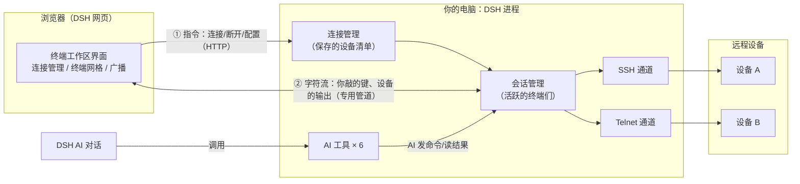
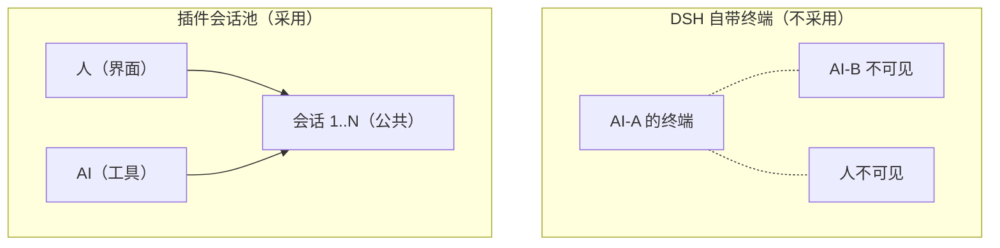
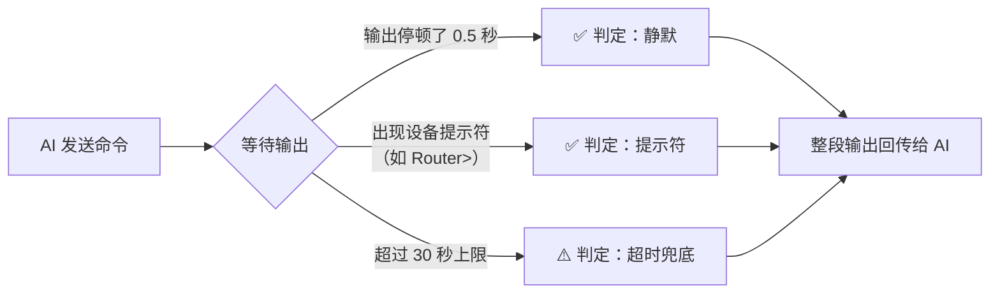
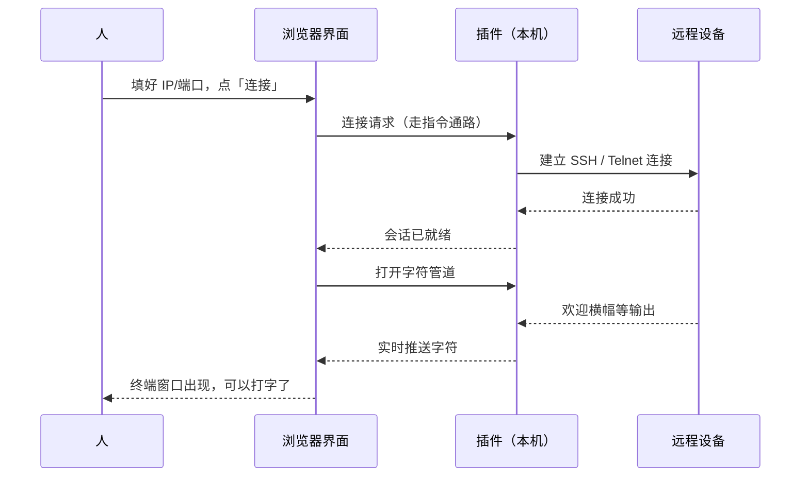
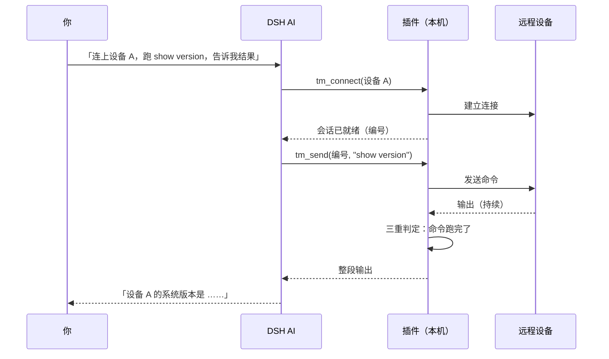
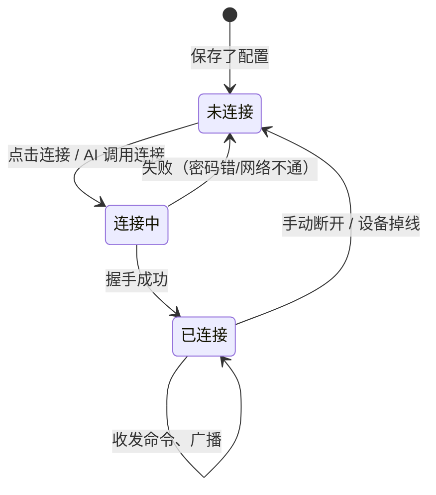
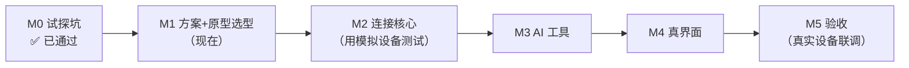

# DSH 终端管理插件 — 方案设计（给人看的版本）

- 状态：M1 讲解稿
- 日期：2026-08-26
- 技术细节完整版见 `spec.md`，本文负责「讲明白」

## 一句话说清楚

给 DeepSeek Harness（DSH）装一个**插件**，让它能像 SecureCRT 那样管理多台远程设备的终端（SSH / Telnet），而且**AI 和人共用同一批终端**——人开的终端 AI 能操作，AI 开的终端人也能看、能接手。

## 为什么要做

今天管多台设备：开一堆终端窗口、逐个敲命令、逐个盯输出；想让 AI 帮忙跑个测试，得人工把命令搬过去、再把结果搬回来。**「AI → 设备终端」这条路是断的。** 本插件把它接上。

## 整体架构

插件分「两半」，一半跑在你电脑上的 DSH 进程里（干活），一半跑在浏览器页面里（显示）：

**两条通路，各司其职：**

- **① 指令通路（慢路）**：保存配置、点连接、断开这类「偶尔发生、要个结果」的操作，走 DSH 现成的接口。
- **② 字符通路（快路）**：你每敲一个键、设备每吐一个字符，走一条专用的实时管道。终端打字不卡，全靠它。

## 核心设计取舍（当时讨论过的）

### 1. 为什么不直接用 DSH 自带的终端功能？

DSH 自带一个「AI 本机终端」：AI 可以在你电脑上开 bash/PowerShell。但它有两个硬限制：

1. 只能开**本机**终端，不能连远程设备；
2. 终端是**AI 私有**的——谁开的归谁，别人（包括人）碰不了。

我们要的是「人和 AI 双向平等、互看互操作」，这在自带体系里做不到。所以：**会话由插件自己管理，是公共资产**——人从界面操作，AI 从工具操作，碰的是同一批会话。

### 2. AI 怎么知道一条命令「跑完了」？

发命令容易，难的是知道什么时候算执行完。我们用**三重保险**，任一条件满足就返回整段输出：

三个参数都可以**按设备单独调**（回显慢的设备调长静默期；有固定提示符的设备填提示符，判定最准）。

## 关键流程走一遍

### 场景 1：人在界面点「连接」

### 场景 2：AI 自动跑测试命令

注意：**这个会话你在界面上同样看得见**——AI 跑命令时，你能实时看到终端里在发生什么；AI 跑完，你接手继续敲也行。

### 会话的一生

## 界面长什么样

挂在 DSH 右侧可拖宽的面板里，**两个页签**：

- **「终端」页**：已连接的设备一格一个终端，实时输出；底部广播栏（一条命令发给全部或选中的设备）。
- **「连接」页**：设备清单，增删改，一键连接/断开。

聊天始终在中间，你可以一边看终端一边跟 AI 说话。三个候选视觉风格见 `prototypes/` 下的交互原型，选定后按它实现。

## 给 AI 的六个「手」

| 工具 | 干什么 |
|---|---|
| `tm_connect` | 连接一台设备（已保存的，或临时指定地址） |
| `tm_list` | 看现在有哪些会话 |
| `tm_send` | 给一个会话发命令，等执行完拿结果 |
| `tm_send_all` | 广播：一条命令发给所有（或指定的）会话 |
| `tm_read` | 读某个会话当前的屏幕内容 |
| `tm_disconnect` | 断开会话 |

## 安全上做了哪些决定（都已和你确认）

| 事项 | 决定 | 防护措施 |
|---|---|---|
| 设备密码/密钥 | 本地明文保存（你接受的风险） | 文件只有本人可读；任何日志、报错、AI 返回值里都不会出现密码 |
| SSH 主机密钥 | MVP 不严格校验（你接受的风险） | 界面显示设备指纹供人工比对；正式版做「首次信任」 |
| 谁能访问 | 只限本机/受信主机 | 沿用 DSH 的访问栅栏，外部请求一律拒绝 |

## 进度与验证方式

- 开发全程用**电脑里模拟的假设备**做自动化测试，不碰你的真实设备；
- 每个阶段结束带证据汇报（测试结果/截图/演示）；
- 最后按「配置连接 → 多终端同屏 → 广播 → AI 自动测试」四幕验收。
